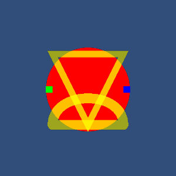

# UnitySkiaDemo

**A demonstration of embedding a SkiaSharp canvas in a Unity project**

- Version 2 (Sept 4, 2017)
- Designed by Andrew Plotkin <erkyrath@eblong.com>
- Includes libraries from [SkiaSharp version 1.59.1][skiadl]

For documentation, see [this blog post][docpost].

The `RawImageDraw.cs` file is public domain. Everything else comes directly from the [Skia][] and [SkiaSharp][] projects (BSD and MIT licenses).

[Skia]: https://skia.org/
[SkiaSharp]: https://github.com/mono/SkiaSharp
[skiadl]: https://www.nuget.org/packages/SkiaSharp/1.59.1
[docpost]: http://blog.zarfhome.com/2017/08/using-skiasharp-in-unity.html

The demo script in this package, when set up correctly in Unity, draws this rather random set of shapes:

